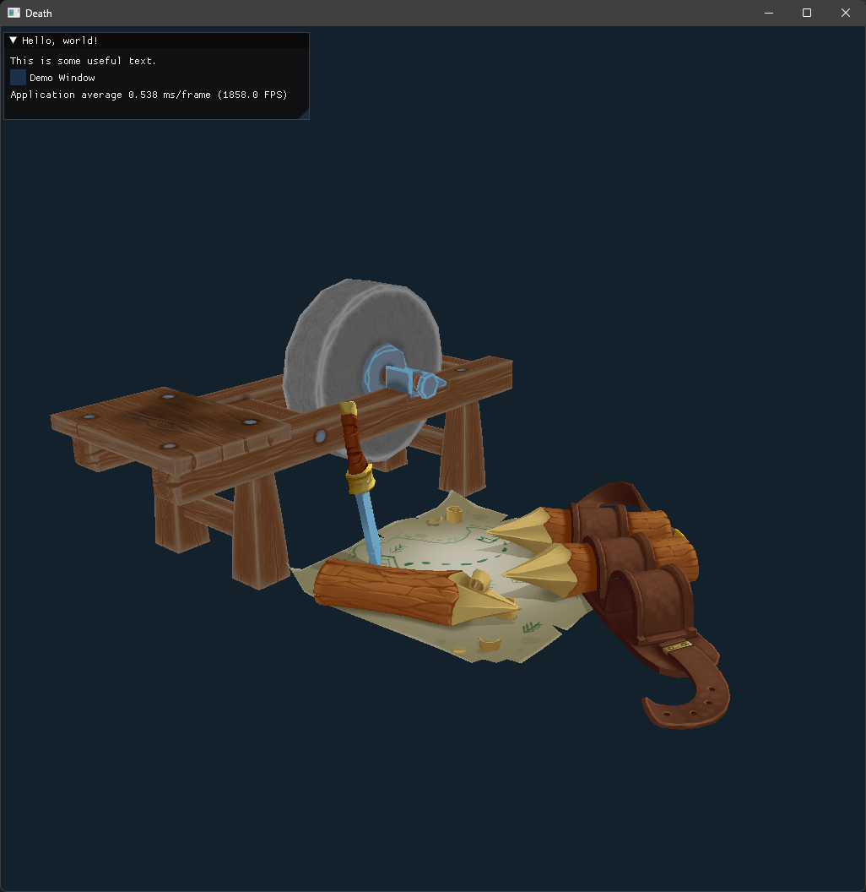
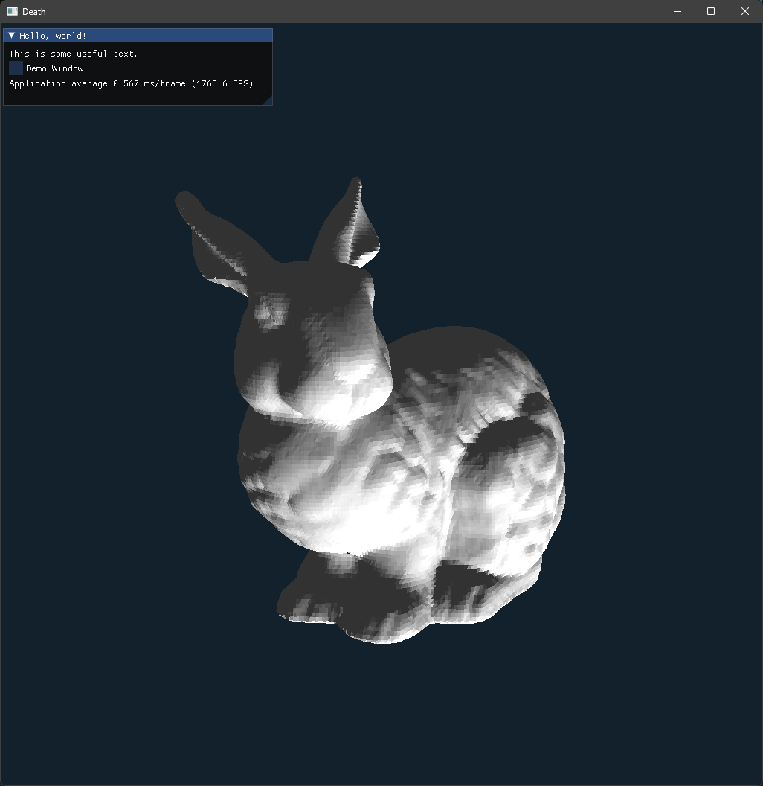

# OpenGL ModelViewer

## Description

A basic OpenGL program created following Victor Gordan  
Can be found here: https://youtu.be/XpBGwZNyUh0?list=PLPaoO-vpZnumdcb4tZc4x5Q-v7CkrQ6M-

My goals for this are to develop it into a more generalist model viewing program, capable of loading a variety of formats using a hopefully using something like a specification file or a python script.

## Features

* Simple ImGui intergration (as in the files exist linked in code but not utilised yet.)
* Simple built in shader using base phong shading.

## Screenshots

## Reflection
**I've been told to reflect more.**

Damn ok i know you have probably read alot of "i learnt alot from this" but seriously i think this has been the most i've learnt from something and actually sparked me to learn more GLSL and OpenGL, i hope to one day make an engine myself where i can build anything i want inside it.

im not sure whatelse to state here except damn i've got respect for engine programmers.

-Alex <3
